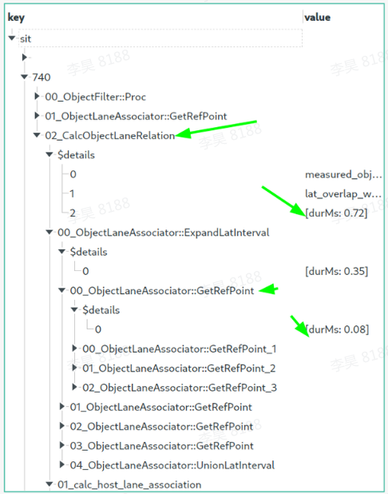

# code-path-report

CodePathReport is a very powerful tool to visualize the code path of nestest function call. 
Additionally, it could visulaize time cost and some details of each function call. 

# Quick start
```
make copmile
make run
```
Then you should get the output like this
```name: "obstacle_map"
obstacle_wise_root_executions {
  key: "main"
  value {
    child_executions {
      name: "Root"
      is_code_block_conditional: false
      duration_ms: 0
      child_executions {
        name: "main"
        is_code_block_conditional: true
        code_block_condition_satisfied: false
        duration_ms: -1.71626201e+12
      }
    }
  }
}
obstacle_wise_root_executions {
  key: "obs_1"
  value {
    child_executions {
      name: "Root"
      is_code_block_conditional: false
      duration_ms: 0
      child_executions {
        name: "Sleep"
        is_code_block_conditional: false
        duration_ms: 0.00244140625
        details: "10"
      }
      child_executions {
        name: "Walk"
        is_code_block_conditional: false
        duration_ms: 0.00244140625
        child_executions {
          name: "Sleep"
          is_code_block_conditional: false
          duration_ms: 0.000244140625
          details: "2"
        }
      }
    }
  }
}
obstacle_wise_root_executions {
  key: "obs_2"
  value {
    child_executions {
      name: "Root"
      is_code_block_conditional: false
      duration_ms: 0
      child_executions {
        name: "Sleep"
        is_code_block_conditional: false
        duration_ms: 0.000244140625
        details: "20"
      }
    }
  }
}
```

You can format the ObstacleCodePathReport to achieve a better visualization such as 

